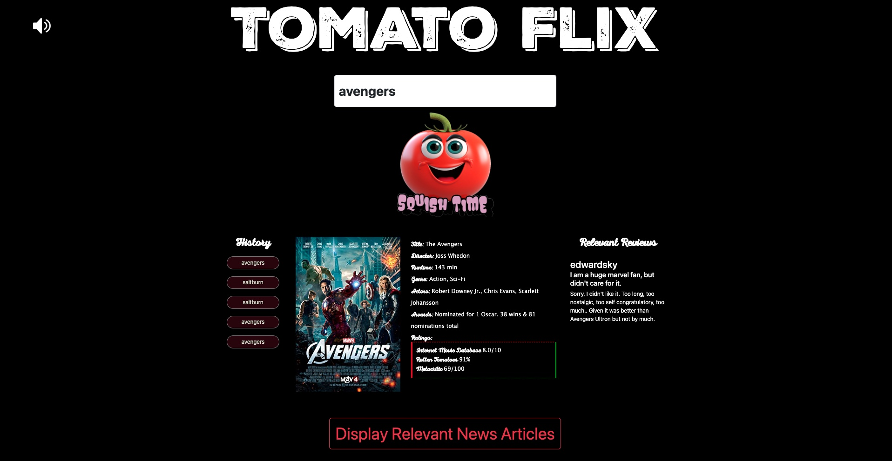

# Tomato-Flix

The latest critical movie database!
## Description

This web-based application acts as a movie database that allows a user to search for a particular title then recieve relevant information, such as the director, genre and even movie poster. The user can also use the application to view critical ratings and reviews for each movie, and they can even search for the latest news and articles about the film!

## User Story

As a user, I want to be able to search a movie by title and be presented with the important information, such as genre, director and movie poster.

As a user, I want to also be presented with ratings and reviews of the movie.

As a user, I want the 5 most recent searches to be saved and presented on the application, even when I refresh the page.

As a user, I want to hear music relevant to the genre of the searched film on the webpage.

As a user, I want to be able to view related news and articles about the film.

As a user, I want the application to be asthetic and easy to navigate.

## Installation

The application is a live webpage so no installation is required.

## Usage

To utilise this application you can visit the webpage by following this URL:

https://nukte-y.github.io/Tomato-Flix/

This will open up a page that looks like this:

From here you can enter a movie title into the search field and hit the 'Squish Time' tomato button to search. The application should return data about the chosen selection. You can also hit the sound icon to play/pause the related sound on the application.

Hitting the 'Display Relevant News Articles' button will display headlines from the latest  industry relevant stories from across the web. Clicking these headlines will redirect the user to that article url.

The 'History' column displays your 5 latest searches, hitting these buttons takes the user back to those previous searches.

## Credits
### Developers
- DrWho1369
- harrynewt0n
- HIYASHE06
- Nukte-y
- Raygbrains22

### Technologies
- Bootstrap 5.3
- JQuery 3.5
- GNews API (https://gnews.io/)
- Rapid API (https://rapidapi.com/contactazguer/api/movie-database-imdb/)

## License

MIT License

Copyright (c) 2024 N.Y.

Permission is hereby granted, free of charge, to any person obtaining a copy
of this software and associated documentation files (the "Software"), to deal
in the Software without restriction, including without limitation the rights
to use, copy, modify, merge, publish, distribute, sublicense, and/or sell
copies of the Software, and to permit persons to whom the Software is
furnished to do so, subject to the following conditions:

The above copyright notice and this permission notice shall be included in all
copies or substantial portions of the Software.

THE SOFTWARE IS PROVIDED "AS IS", WITHOUT WARRANTY OF ANY KIND, EXPRESS OR
IMPLIED, INCLUDING BUT NOT LIMITED TO THE WARRANTIES OF MERCHANTABILITY,
FITNESS FOR A PARTICULAR PURPOSE AND NONINFRINGEMENT. IN NO EVENT SHALL THE
AUTHORS OR COPYRIGHT HOLDERS BE LIABLE FOR ANY CLAIM, DAMAGES OR OTHER
LIABILITY, WHETHER IN AN ACTION OF CONTRACT, TORT OR OTHERWISE, ARISING FROM,
OUT OF OR IN CONNECTION WITH THE SOFTWARE OR THE USE OR OTHER DEALINGS IN THE
SOFTWARE.